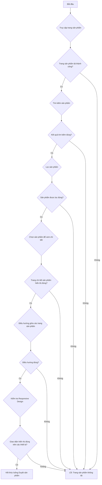
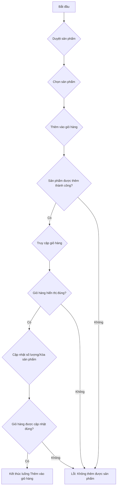
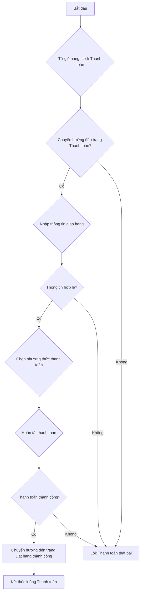
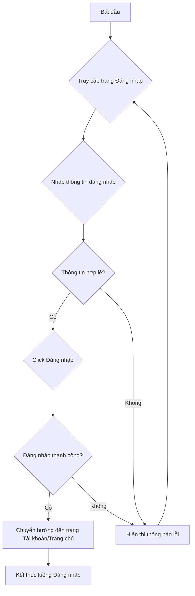
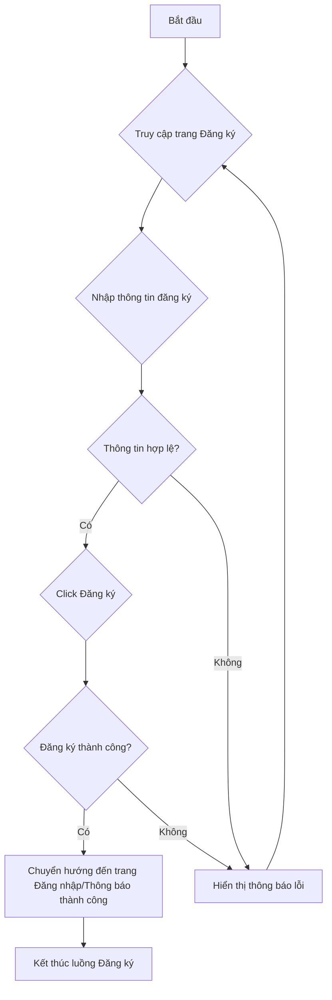
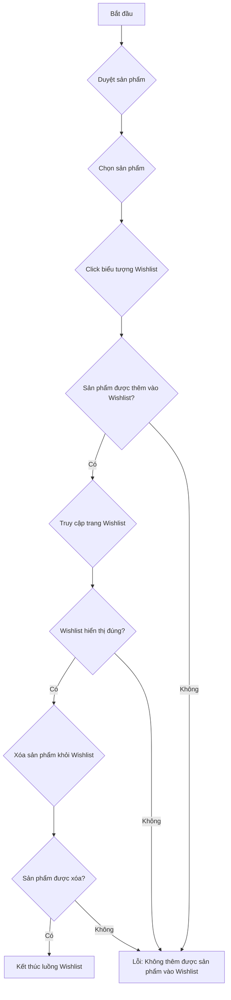
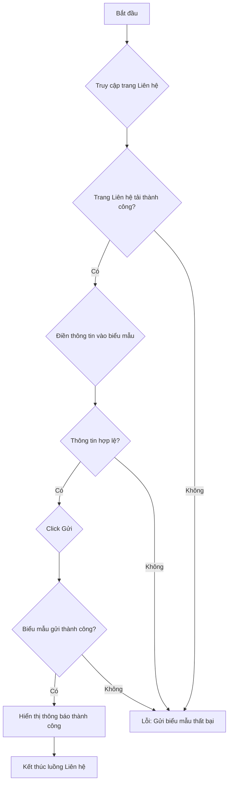
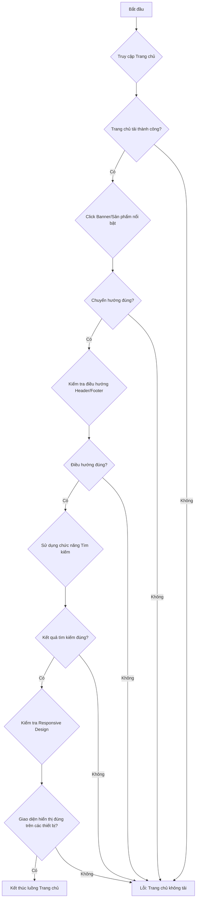

# Kế hoạch kiểm thử dự án Sale_Project

## Mục tiêu

Kế hoạch này nhằm mục đích xác định các luồng nghiệp vụ chính của dự án Sale_Project và lập kế hoạch kiểm thử chi tiết cho từng luồng, bao gồm các trường hợp kiểm thử (test case), loại kiểm thử (unit, integration, UI, e2e) và tiêu chí hoàn thành.

## Các luồng nghiệp vụ chính

Dựa trên cấu trúc dự án và các trang chính, các luồng nghiệp vụ chính được xác định bao gồm:

1.  Duyệt sản phẩm
2.  Thêm sản phẩm vào giỏ hàng
3.  Thanh toán
4.  Đăng nhập
5.  Đăng ký
6.  Thêm sản phẩm vào Wishlist
7.  Quản lý tài khoản
8.  Liên hệ
9.  FAQ
10. Trang chủ
11. Về chúng tôi

---

## 1. Kế hoạch kiểm thử cho luồng nghiệp vụ: Duyệt sản phẩm

**Mục tiêu:** Đảm bảo người dùng có thể tìm kiếm, xem và tương tác với các sản phẩm một cách hiệu quả.

**Các trang liên quan:** [`Index.tsx`](src/pages/Index.tsx), [`Products.tsx`](src/pages/Products.tsx), [`ProductDetailPage.tsx`](src/pages/ProductDetailPage.tsx)

**Các Test Case:**

1.  **TC_DP_001: Tải trang sản phẩm thành công**
    *   **Mô tả:** Kiểm tra xem trang sản phẩm (`Products.tsx`) có tải thành công và hiển thị danh sách sản phẩm hay không.
    *   **Loại Test:** UI, E2E
    *   **Tiêu chí hoàn thành:**
        *   Trang tải không có lỗi.
        *   Các sản phẩm được hiển thị đầy đủ và chính xác (tên, giá, hình ảnh).
        *   Phân trang (nếu có) hoạt động đúng.

2.  **TC_DP_002: Tìm kiếm sản phẩm theo tên**
    *   **Mô tả:** Kiểm tra chức năng tìm kiếm sản phẩm hoạt động đúng khi tìm kiếm theo tên sản phẩm.
    *   **Loại Test:** Integration, E2E
    *   **Tiêu chí hoàn thành:**
        *   Kết quả tìm kiếm hiển thị các sản phẩm có chứa từ khóa.
        *   Tìm kiếm không phân biệt chữ hoa/thường.
        *   Không có kết quả khi tìm kiếm sản phẩm không tồn tại.

3.  **TC_DP_003: Lọc sản phẩm theo danh mục/thương hiệu**
    *   **Mô tả:** Kiểm tra chức năng lọc sản phẩm theo các tiêu chí khác nhau (danh mục, thương hiệu, giá, v.v.).
    *   **Loại Test:** Integration, E2E
    *   **Tiêu chí hoàn thành:**
        *   Sản phẩm được lọc chính xác theo tiêu chí đã chọn.
        *   Có thể áp dụng nhiều bộ lọc cùng lúc.
        *   Xóa bộ lọc hoạt động đúng.

4.  **TC_DP_004: Xem chi tiết sản phẩm**
    *   **Mô tả:** Kiểm tra người dùng có thể nhấp vào một sản phẩm và chuyển đến trang chi tiết sản phẩm (`ProductDetailPage.tsx`).
    *   **Loại Test:** UI, E2E
    *   **Tiêu chí hoàn thành:**
        *   Trang chi tiết sản phẩm hiển thị đầy đủ thông tin (mô tả, giá, hình ảnh, thuộc tính, đánh giá).
        *   Nút "Thêm vào giỏ hàng" hoạt động.
        *   Nút "Thêm vào Wishlist" hoạt động.

5.  **TC_DP_005: Điều hướng giữa các trang sản phẩm**
    *   **Mô tả:** Kiểm tra việc điều hướng giữa các trang sản phẩm (phân trang, quay lại trang trước/sau).
    *   **Loại Test:** UI, E2E
    *   **Tiêu chí hoàn thành:**
        *   Các nút phân trang hoạt động đúng (trang đầu, trang cuối, trang kế tiếp, trang trước).
        *   URL thay đổi tương ứng với trang.

6.  **TC_DP_006: Phản hồi của trang sản phẩm trên các thiết bị khác nhau**
    *   **Mô tả:** Kiểm tra giao diện và chức năng của trang sản phẩm trên các kích thước màn hình khác nhau (responsive design).
    *   **Loại Test:** UI, E2E
    *   **Tiêu chí hoàn thành:**
        *   Giao diện hiển thị đúng trên di động, máy tính bảng và máy tính để bàn.
        *   Các chức năng (tìm kiếm, lọc, xem chi tiết) vẫn hoạt động bình thường.

**Sơ đồ luồng kiểm thử (Mermaid Flowchart):**



---

## 2. Kế hoạch kiểm thử cho luồng nghiệp vụ: Thêm sản phẩm vào giỏ hàng

**Mục tiêu:** Đảm bảo người dùng có thể thêm sản phẩm vào giỏ hàng một cách chính xác từ nhiều vị trí khác nhau và quản lý giỏ hàng hiệu quả.

**Các trang liên quan:** [`Products.tsx`](src/pages/Products.tsx), [`ProductDetailPage.tsx`](src/pages/ProductDetailPage.tsx), [`Cart.tsx`](src/pages/Cart.tsx)

**Các Test Case:**

1.  **TC_ATC_001: Thêm sản phẩm từ trang danh sách sản phẩm**
    *   **Mô tả:** Kiểm tra người dùng có thể thêm sản phẩm vào giỏ hàng trực tiếp từ trang danh sách sản phẩm.
    *   **Loại Test:** UI, E2E
    *   **Tiêu chí hoàn thành:**
        *   Sản phẩm được thêm vào giỏ hàng thành công.
        *   Số lượng sản phẩm trong giỏ hàng (biểu tượng giỏ hàng) được cập nhật đúng.
        *   Thông báo "Thêm vào giỏ hàng thành công" hiển thị (nếu có).

2.  **TC_ATC_002: Thêm sản phẩm từ trang chi tiết sản phẩm**
    *   **Mô tả:** Kiểm tra người dùng có thể thêm sản phẩm vào giỏ hàng từ trang chi tiết sản phẩm.
    *   **Loại Test:** UI, E2E
    *   **Tiêu chí hoàn thành:**
        *   Sản phẩm được thêm vào giỏ hàng thành công.
        *   Số lượng sản phẩm trong giỏ hàng được cập nhật đúng.
        *   Thông báo "Thêm vào giỏ hàng thành công" hiển thị (nếu có).
        *   Có thể chọn số lượng và các tùy chọn khác (kích thước, màu sắc) trước khi thêm.

3.  **TC_ATC_003: Thêm nhiều sản phẩm cùng loại vào giỏ hàng**
    *   **Mô tả:** Kiểm tra khi thêm nhiều lần cùng một sản phẩm, số lượng sản phẩm trong giỏ hàng được cập nhật đúng.
    *   **Loại Test:** Integration, E2E
    *   **Tiêu chí hoàn thành:**
        *   Số lượng sản phẩm trong giỏ hàng tăng lên theo số lượng đã thêm.
        *   Tổng tiền trong giỏ hàng được tính toán lại chính xác.

4.  **TC_ATC_004: Thêm sản phẩm vượt quá số lượng tồn kho**
    *   **Mô tả:** Kiểm tra hệ thống xử lý khi người dùng cố gắng thêm số lượng sản phẩm vượt quá số lượng tồn kho.
    *   **Loại Test:** Integration, E2E
    *   **Tiêu chí hoàn thành:**
        *   Hệ thống hiển thị thông báo lỗi phù hợp (ví dụ: "Số lượng tồn kho không đủ").
        *   Không cho phép thêm sản phẩm vượt quá số lượng tồn kho.

5.  **TC_ATC_005: Truy cập giỏ hàng**
    *   **Mô tả:** Kiểm tra người dùng có thể truy cập trang giỏ hàng (`Cart.tsx`) từ bất kỳ trang nào.
    *   **Loại Test:** UI, E2E
    *   **Tiêu chí hoàn thành:**
        *   Người dùng được chuyển hướng đến trang giỏ hàng.
        *   Các sản phẩm đã thêm được hiển thị đầy đủ trong giỏ hàng.

6.  **TC_ATC_006: Cập nhật số lượng sản phẩm trong giỏ hàng**
    *   **Mô tả:** Kiểm tra người dùng có thể thay đổi số lượng sản phẩm đã có trong giỏ hàng.
    *   **Loại Test:** UI, E2E
    *   **Tiêu chí hoàn thành:**
        *   Số lượng sản phẩm được cập nhật đúng.
        *   Tổng tiền của giỏ hàng được tính toán lại chính xác.
        *   Không thể cập nhật số lượng về 0 hoặc số âm.
        *   Không thể cập nhật số lượng vượt quá tồn kho.

7.  **TC_ATC_007: Xóa sản phẩm khỏi giỏ hàng**
    *   **Mô tả:** Kiểm tra người dùng có thể xóa một sản phẩm khỏi giỏ hàng.
    *   **Loại Test:** UI, E2E
    *   **Tiêu chí hoàn thành:**
        *   Sản phẩm được xóa khỏi giỏ hàng.
        *   Tổng tiền của giỏ hàng được tính toán lại chính xác.
        *   Giỏ hàng trống khi tất cả sản phẩm bị xóa.

8.  **TC_ATC_008: Giỏ hàng trống**
    *   **Mô tả:** Kiểm tra hiển thị của giỏ hàng khi không có sản phẩm nào.
    *   **Loại Test:** UI
    *   **Tiêu chí hoàn thành:**
        *   Hiển thị thông báo "Giỏ hàng trống" hoặc tương tự.
        *   Không có sản phẩm nào được liệt kê.
        *   Các nút liên quan đến thanh toán bị ẩn hoặc vô hiệu hóa.

**Sơ đồ luồng kiểm thử (Mermaid Flowchart):**



---

## 3. Kế hoạch kiểm thử cho luồng nghiệp vụ: Thanh toán

**Mục tiêu:** Đảm bảo người dùng có thể hoàn tất quá trình đặt hàng và thanh toán một cách an toàn và chính xác.

**Các trang liên quan:** [`Cart.tsx`](src/pages/Cart.tsx), [`Checkout.tsx`](src/pages/Checkout.tsx), [`OrderSuccess.tsx`](src/pages/OrderSuccess.tsx)

**Các Test Case:**

1.  **TC_PAY_001: Bắt đầu quá trình thanh toán từ giỏ hàng**
    *   **Mô tả:** Kiểm tra người dùng có thể chuyển từ trang giỏ hàng sang trang thanh toán.
    *   **Loại Test:** UI, E2E
    *   **Tiêu chí hoàn thành:**
        *   Nút "Thanh toán" hoặc "Tiến hành đặt hàng" trên trang giỏ hàng hoạt động đúng.
        *   Người dùng được chuyển hướng đến trang thanh toán (`Checkout.tsx`).
        *   Thông tin sản phẩm trong giỏ hàng được chuyển sang trang thanh toán chính xác.

2.  **TC_PAY_002: Nhập thông tin giao hàng hợp lệ**
    *   **Mô tả:** Kiểm tra việc nhập thông tin giao hàng (tên, địa chỉ, số điện thoại, email) hợp lệ.
    *   **Loại Test:** UI, E2E
    *   **Tiêu chí hoàn thành:**
        *   Tất cả các trường bắt buộc được điền đầy đủ.
        *   Thông tin được lưu trữ và hiển thị đúng.
        *   Chuyển sang bước tiếp theo (chọn phương thức thanh toán) thành công.

3.  **TC_PAY_003: Nhập thông tin giao hàng không hợp lệ**
    *   **Mô tả:** Kiểm tra hệ thống xử lý khi người dùng nhập thông tin giao hàng không hợp lệ (bỏ trống trường bắt buộc, sai định dạng email/số điện thoại).
    *   **Loại Test:** UI, E2E
    *   **Tiêu chí hoàn thành:**
        *   Hệ thống hiển thị thông báo lỗi rõ ràng cho từng trường không hợp lệ.
        *   Không cho phép tiến hành thanh toán nếu thông tin không hợp lệ.

4.  **TC_PAY_004: Chọn phương thức thanh toán**
    *   **Mô tả:** Kiểm tra người dùng có thể chọn các phương thức thanh toán khác nhau (thanh toán khi nhận hàng, thẻ tín dụng, v.v.).
    *   **Loại Test:** UI, E2E
    *   **Tiêu chí hoàn thành:**
        *   Các tùy chọn phương thức thanh toán được hiển thị rõ ràng.
        *   Người dùng có thể chọn một phương thức thanh toán.
        *   Thông tin cần thiết cho phương thức thanh toán được hiển thị (ví dụ: trường nhập thông tin thẻ).

5.  **TC_PAY_005: Hoàn tất thanh toán thành công**
    *   **Mô tả:** Kiểm tra quá trình thanh toán hoàn tất thành công.
    *   **Loại Test:** E2E
    *   **Tiêu chí hoàn thành:**
        *   Người dùng được chuyển hướng đến trang xác nhận đơn hàng thành công (`OrderSuccess.tsx`).
        *   Thông tin đơn hàng được hiển thị chính xác (mã đơn hàng, tổng tiền, sản phẩm).
        *   Email xác nhận đơn hàng được gửi đi (kiểm tra thủ công hoặc thông qua log).

6.  **TC_PAY_006: Xử lý lỗi thanh toán**
    *   **Mô tả:** Kiểm tra hệ thống xử lý khi có lỗi xảy ra trong quá trình thanh toán (ví dụ: thẻ tín dụng không hợp lệ, lỗi cổng thanh toán).
    *   **Loại Test:** E2E
    *   **Tiêu chí hoàn thành:**
        *   Hệ thống hiển thị thông báo lỗi rõ ràng và hướng dẫn người dùng thử lại hoặc liên hệ hỗ trợ.
        *   Đơn hàng không được tạo hoặc được đánh dấu là thất bại.

7.  **TC_PAY_007: Áp dụng mã giảm giá/voucher**
    *   **Mô tả:** Kiểm tra chức năng áp dụng mã giảm giá hoặc voucher (nếu có).
    *   **Loại Test:** Integration, E2E
    *   **Tiêu chí hoàn thành:**
        *   Mã giảm giá hợp lệ được áp dụng thành công, tổng tiền giảm đúng.
        *   Mã giảm giá không hợp lệ hiển thị thông báo lỗi.
        *   Mã giảm giá đã sử dụng không thể áp dụng lại.

**Sơ đồ luồng kiểm thử (Mermaid Flowchart):**



---

## 4. Kế hoạch kiểm thử cho luồng nghiệp vụ: Đăng nhập

**Mục tiêu:** Đảm bảo người dùng có thể đăng nhập vào hệ thống một cách an toàn và chính xác, cũng như xử lý các trường hợp lỗi.

**Các trang liên quan:** [`Login.tsx`](src/pages/Login.tsx), [`Account.tsx`](src/pages/Account.tsx)

**Các Test Case:**

1.  **TC_LOGIN_001: Đăng nhập thành công với thông tin hợp lệ**
    *   **Mô tả:** Kiểm tra người dùng có thể đăng nhập thành công với tên người dùng/email và mật khẩu hợp lệ.
    *   **Loại Test:** E2E
    *   **Tiêu chí hoàn thành:**
        *   Người dùng được chuyển hướng đến trang tài khoản hoặc trang chủ sau khi đăng nhập.
        *   Tên người dùng hoặc trạng thái đăng nhập được hiển thị chính xác.
        *   Không có thông báo lỗi.

2.  **TC_LOGIN_002: Đăng nhập thất bại với tên người dùng/email không tồn tại**
    *   **Mô tả:** Kiểm tra hệ thống xử lý khi người dùng cố gắng đăng nhập với tên người dùng/email không tồn tại.
    *   **Loại Test:** E2E
    *   **Tiêu chí hoàn thành:**
        *   Hệ thống hiển thị thông báo lỗi phù hợp (ví dụ: "Tên người dùng hoặc mật khẩu không đúng").
        *   Người dùng vẫn ở trang đăng nhập.

3.  **TC_LOGIN_003: Đăng nhập thất bại với mật khẩu sai**
    *   **Mô tả:** Kiểm tra hệ thống xử lý khi người dùng cố gắng đăng nhập với mật khẩu sai cho một tên người dùng/email hợp lệ.
    *   **Loại Test:** E2E
    *   **Tiêu chí hoàn thành:**
        *   Hệ thống hiển thị thông báo lỗi phù hợp (ví dụ: "Tên người dùng hoặc mật khẩu không đúng").
        *   Người dùng vẫn ở trang đăng nhập.

4.  **TC_LOGIN_004: Đăng nhập với trường trống**
    *   **Mô tả:** Kiểm tra hệ thống xử lý khi người dùng để trống các trường tên người dùng/email hoặc mật khẩu.
    *   **Loại Test:** UI, E2E
    *   **Tiêu chí hoàn thành:**
        *   Hệ thống hiển thị thông báo lỗi yêu cầu điền đầy đủ thông tin.
        *   Nút đăng nhập bị vô hiệu hóa hoặc không cho phép gửi biểu mẫu.

5.  **TC_LOGIN_005: Chức năng "Quên mật khẩu"**
    *   **Mô tả:** Kiểm tra chức năng "Quên mật khẩu" hoạt động đúng.
    *   **Loại Test:** E2E
    *   **Tiêu chí hoàn thành:**
        *   Khi nhấp vào "Quên mật khẩu", người dùng được chuyển hướng đến trang khôi phục mật khẩu.
        *   Có thể gửi yêu cầu khôi phục mật khẩu và nhận email hướng dẫn.

6.  **TC_LOGIN_006: Duy trì trạng thái đăng nhập (Remember Me)**
    *   **Mô tả:** Kiểm tra chức năng "Ghi nhớ tôi" (nếu có) hoạt động đúng, giữ người dùng đăng nhập sau khi đóng trình duyệt.
    *   **Loại Test:** E2E
    *   **Tiêu chí hoàn thành:**
        *   Người dùng vẫn đăng nhập sau khi đóng và mở lại trình duyệt.
        *   Phiên đăng nhập hết hạn sau một khoảng thời gian nhất định (nếu có chính sách).

7.  **TC_LOGIN_007: Đăng xuất**
    *   **Mô tả:** Kiểm tra người dùng có thể đăng xuất khỏi hệ thống.
    *   **Loại Test:** UI, E2E
    *   **Tiêu chí hoàn thành:**
        *   Người dùng được chuyển hướng đến trang đăng nhập hoặc trang chủ.
        *   Trạng thái đăng nhập thay đổi thành "chưa đăng nhập".
        *   Không thể truy cập các trang yêu cầu đăng nhập sau khi đăng xuất.

**Sơ đồ luồng kiểm thử (Mermaid Flowchart):**



---

## 5. Kế hoạch kiểm thử cho luồng nghiệp vụ: Đăng ký

**Mục tiêu:** Đảm bảo người dùng có thể đăng ký tài khoản mới một cách an toàn và chính xác, cũng như xử lý các trường hợp lỗi.

**Các trang liên quan:** [`Register.tsx`](src/pages/Register.tsx), [`Login.tsx`](src/pages/Login.tsx)

**Các Test Case:**

1.  **TC_REG_001: Đăng ký tài khoản thành công với thông tin hợp lệ**
    *   **Mô tả:** Kiểm tra người dùng có thể đăng ký tài khoản mới với tất cả thông tin bắt buộc hợp lệ (email, mật khẩu, xác nhận mật khẩu).
    *   **Loại Test:** E2E
    *   **Tiêu chí hoàn thành:**
        *   Tài khoản được tạo thành công.
        *   Người dùng được chuyển hướng đến trang đăng nhập hoặc thông báo đăng ký thành công.
        *   Không có thông báo lỗi.
        *   Có thể đăng nhập bằng tài khoản vừa tạo.

2.  **TC_REG_002: Đăng ký thất bại với email đã tồn tại**
    *   **Mô tả:** Kiểm tra hệ thống xử lý khi người dùng cố gắng đăng ký với một địa chỉ email đã được sử dụng.
    *   **Loại Test:** E2E
    *   **Tiêu chí hoàn thành:**
        *   Hệ thống hiển thị thông báo lỗi phù hợp (ví dụ: "Email đã tồn tại").
        *   Người dùng vẫn ở trang đăng ký.
        *   Tài khoản mới không được tạo.

3.  **TC_REG_003: Đăng ký thất bại với mật khẩu không khớp**
    *   **Mô tả:** Kiểm tra hệ thống xử lý khi mật khẩu và mật khẩu xác nhận không khớp.
    *   **Loại Test:** UI, E2E
    *   **Tiêu chí hoàn thành:**
        *   Hệ thống hiển thị thông báo lỗi phù hợp (ví dụ: "Mật khẩu không khớp").
        *   Người dùng vẫn ở trang đăng ký.

4.  **TC_REG_004: Đăng ký với các trường bắt buộc trống**
    *   **Mô tả:** Kiểm tra hệ thống xử lý khi người dùng để trống các trường bắt buộc (email, mật khẩu, xác nhận mật khẩu).
    *   **Loại Test:** UI, E2E
    *   **Tiêu chí hoàn thành:**
        *   Hệ thống hiển thị thông báo lỗi yêu cầu điền đầy đủ thông tin cho từng trường trống.
        *   Nút đăng ký bị vô hiệu hóa hoặc không cho phép gửi biểu mẫu.

5.  **TC_REG_005: Đăng ký với định dạng email không hợp lệ**
    *   **Mô tả:** Kiểm tra hệ thống xử lý khi người dùng nhập địa chỉ email không đúng định dạng.
    *   **Loại Test:** UI, E2E
    *   **Tiêu chí hoàn thành:**
        *   Hệ thống hiển thị thông báo lỗi phù hợp (ví dụ: "Định dạng email không hợp lệ").
        *   Người dùng vẫn ở trang đăng ký.

6.  **TC_REG_006: Đăng ký với mật khẩu yếu (nếu có quy tắc)**
    *   **Mô tả:** Kiểm tra hệ thống xử lý khi người dùng nhập mật khẩu không đáp ứng các yêu cầu về độ mạnh (ví dụ: không đủ ký tự, thiếu ký tự đặc biệt, chữ hoa/thường).
    *   **Loại Test:** UI, E2E
    *   **Tiêu chí hoàn thành:**
        *   Hệ thống hiển thị thông báo lỗi phù hợp, chỉ rõ yêu cầu về mật khẩu.
        *   Người dùng vẫn ở trang đăng ký.

**Sơ đồ luồng kiểm thử (Mermaid Flowchart):**



---

## 6. Kế hoạch kiểm thử cho luồng nghiệp vụ: Thêm sản phẩm vào Wishlist

**Mục tiêu:** Đảm bảo người dùng có thể thêm, xóa sản phẩm khỏi danh sách yêu thích và quản lý danh sách này hiệu quả.

**Các trang liên quan:** [`Products.tsx`](src/pages/Products.tsx), [`ProductDetailPage.tsx`](src/pages/ProductDetailPage.tsx), [`Wishlist.tsx`](src/pages/Wishlist.tsx)

**Các Test Case:**

1.  **TC_WL_001: Thêm sản phẩm vào Wishlist từ trang danh sách sản phẩm**
    *   **Mô tả:** Kiểm tra người dùng có thể thêm sản phẩm vào Wishlist trực tiếp từ trang danh sách sản phẩm.
    *   **Loại Test:** UI, E2E
    *   **Tiêu chí hoàn thành:**
        *   Sản phẩm được thêm vào Wishlist thành công.
        *   Biểu tượng Wishlist (nếu có) thay đổi trạng thái (ví dụ: từ outline thành fill).
        *   Thông báo "Thêm vào Wishlist thành công" hiển thị (nếu có).

2.  **TC_WL_002: Thêm sản phẩm vào Wishlist từ trang chi tiết sản phẩm**
    *   **Mô tả:** Kiểm tra người dùng có thể thêm sản phẩm vào Wishlist từ trang chi tiết sản phẩm.
    *   **Loại Test:** UI, E2E
    *   **Tiêu chí hoàn thành:**
        *   Sản phẩm được thêm vào Wishlist thành công.
        *   Biểu tượng Wishlist thay đổi trạng thái.
        *   Thông báo "Thêm vào Wishlist thành công" hiển thị (nếu có).

3.  **TC_WL_003: Xóa sản phẩm khỏi Wishlist từ trang Wishlist**
    *   **Mô tả:** Kiểm tra người dùng có thể xóa một sản phẩm khỏi Wishlist từ trang Wishlist.
    *   **Loại Test:** UI, E2E
    *   **Tiêu chí hoàn thành:**
        *   Sản phẩm được xóa khỏi Wishlist thành công.
        *   Số lượng sản phẩm trong Wishlist giảm.
        *   Thông báo "Xóa khỏi Wishlist thành công" hiển thị (nếu có).

4.  **TC_WL_004: Xóa sản phẩm khỏi Wishlist từ trang sản phẩm/chi tiết sản phẩm**
    *   **Mô tả:** Kiểm tra người dùng có thể xóa một sản phẩm khỏi Wishlist từ trang danh sách sản phẩm hoặc trang chi tiết sản phẩm (nếu có chức năng).
    *   **Loại Test:** UI, E2E
    *   **Tiêu chí hoàn thành:**
        *   Sản phẩm được xóa khỏi Wishlist thành công.
        *   Biểu tượng Wishlist thay đổi trạng thái (ví dụ: từ fill thành outline).
        *   Thông báo "Xóa khỏi Wishlist thành công" hiển thị (nếu có).

5.  **TC_WL_005: Truy cập trang Wishlist**
    *   **Mô tả:** Kiểm tra người dùng có thể truy cập trang Wishlist (`Wishlist.tsx`).
    *   **Loại Test:** UI, E2E
    *   **Tiêu chí hoàn thành:**
        *   Người dùng được chuyển hướng đến trang Wishlist.
        *   Các sản phẩm đã thêm vào Wishlist được hiển thị đầy đủ và chính xác.

6.  **TC_WL_006: Thêm sản phẩm đã có trong Wishlist**
    *   **Mô tả:** Kiểm tra hệ thống xử lý khi người dùng cố gắng thêm một sản phẩm đã có trong Wishlist.
    *   **Loại Test:** UI, E2E
    *   **Tiêu chí hoàn thành:**
        *   Hệ thống không thêm sản phẩm trùng lặp.
        *   Hiển thị thông báo phù hợp (ví dụ: "Sản phẩm đã có trong Wishlist").
        *   Biểu tượng Wishlist vẫn ở trạng thái "đã thêm".

7.  **TC_WL_007: Wishlist trống**
    *   **Mô tả:** Kiểm tra hiển thị của trang Wishlist khi không có sản phẩm nào.
    *   **Loại Test:** UI
    *   **Tiêu chí hoàn thành:**
        *   Hiển thị thông báo "Wishlist trống" hoặc tương tự.
        *   Không có sản phẩm nào được liệt kê.

**Sơ đồ luồng kiểm thử (Mermaid Flowchart):**



---

## 7. Kế hoạch kiểm thử cho luồng nghiệp vụ: Quản lý tài khoản

**Mục tiêu:** Đảm bảo người dùng có thể quản lý thông tin cá nhân, địa chỉ, đơn hàng và các cài đặt khác của tài khoản một cách an toàn và hiệu quả.

**Các trang liên quan:** [`Account.tsx`](src/pages/Account.tsx)

**Các Test Case:**

1.  **TC_ACC_001: Truy cập trang tài khoản**
    *   **Mô tả:** Kiểm tra người dùng có thể truy cập trang tài khoản sau khi đăng nhập.
    *   **Loại Test:** UI, E2E
    *   **Tiêu chí hoàn thành:**
        *   Người dùng được chuyển hướng đến trang tài khoản (`Account.tsx`).
        *   Trang tài khoản hiển thị các mục quản lý (thông tin cá nhân, địa chỉ, đơn hàng, v.v.).

2.  **TC_ACC_002: Cập nhật thông tin cá nhân**
    *   **Mô tả:** Kiểm tra người dùng có thể cập nhật thông tin cá nhân (tên, email, số điện thoại, v.v.).
    *   **Loại Test:** UI, E2E
    *   **Tiêu chí hoàn thành:**
        *   Thông tin được cập nhật thành công và hiển thị đúng.
        *   Hệ thống xử lý các trường hợp không hợp lệ (ví dụ: email đã tồn tại, định dạng số điện thoại sai).
        *   Thông báo cập nhật thành công hiển thị (nếu có).

3.  **TC_ACC_003: Thay đổi mật khẩu**
    *   **Mô tả:** Kiểm tra người dùng có thể thay đổi mật khẩu tài khoản.
    *   **Loại Test:** E2E
    *   **Tiêu chí hoàn thành:**
        *   Mật khẩu được thay đổi thành công.
        *   Yêu cầu mật khẩu hiện tại chính xác.
        *   Yêu cầu mật khẩu mới đáp ứng các tiêu chí độ mạnh.
        *   Thông báo thay đổi mật khẩu thành công hiển thị.
        *   Có thể đăng nhập bằng mật khẩu mới.

4.  **TC_ACC_004: Quản lý địa chỉ giao hàng**
    *   **Mô tả:** Kiểm tra người dùng có thể thêm, sửa, xóa địa chỉ giao hàng.
    *   **Loại Test:** UI, E2E
    *   **Tiêu chí hoàn thành:**
        *   Có thể thêm địa chỉ mới với đầy đủ thông tin.
        *   Có thể chỉnh sửa thông tin của địa chỉ hiện có.
        *   Có thể xóa địa chỉ.
        *   Địa chỉ mặc định được quản lý đúng.

5.  **TC_ACC_005: Xem lịch sử đơn hàng**
    *   **Mô tả:** Kiểm tra người dùng có thể xem danh sách các đơn hàng đã đặt.
    *   **Loại Test:** UI, E2E
    *   **Tiêu chí hoàn thành:**
        *   Danh sách đơn hàng hiển thị đầy đủ (mã đơn hàng, ngày đặt, tổng tiền, trạng thái).
        *   Có thể xem chi tiết từng đơn hàng (sản phẩm, địa chỉ giao hàng, phương thức thanh toán).

6.  **TC_ACC_006: Các cài đặt tài khoản khác (ví dụ: thông báo, ưu tiên)**
    *   **Mô tả:** Kiểm tra các cài đặt tài khoản khác (nếu có) hoạt động đúng.
    *   **Loại Test:** UI, E2E
    *   **Tiêu chí hoàn thành:**
        *   Cài đặt được lưu và áp dụng thành công.
        *   Thông báo cập nhật cài đặt thành công hiển thị.

**Sơ đồ luồng kiểm thử (Mermaid Flowchart):**

```mermaid
graph TD
    A[Bắt đầu] --> B{Đăng nhập thành công};
    B --> C{Truy cập trang Tài khoản};
    C --> D{Trang Tài khoản hiển thị đúng?};
    D -- Có --> E{Chọn mục quản lý (Thông tin cá nhân/Địa chỉ/Đơn hàng)};
    E --> F{Thực hiện hành động (Cập nhật/Thêm/Sửa/Xóa)};
    F --> G{Hành động thành công?};
    G -- Có --> H[Kết thúc luồng Quản lý tài khoản];
    D -- Không --> I[Lỗi: Trang Tài khoản không hiển thị];
    G -- Không --> I[Lỗi: Hành động thất bại];
```

---

## 8. Kế hoạch kiểm thử cho luồng nghiệp vụ: Liên hệ

**Mục tiêu:** Đảm bảo người dùng có thể gửi thông tin liên hệ hoặc câu hỏi đến bộ phận hỗ trợ một cách chính xác và nhận được phản hồi phù hợp.

**Các trang liên quan:** [`Contact.tsx`](src/pages/Contact.tsx)

**Các Test Case:**

1.  **TC_CONTACT_001: Tải trang liên hệ thành công**
    *   **Mô tả:** Kiểm tra trang liên hệ (`Contact.tsx`) có tải thành công và hiển thị đầy đủ các trường thông tin.
    *   **Loại Test:** UI, E2E
    *   **Tiêu chí hoàn thành:**
        *   Trang tải không có lỗi.
        *   Các trường nhập liệu (tên, email, chủ đề, nội dung tin nhắn) và nút gửi hiển thị rõ ràng.
        *   Thông tin liên hệ (địa chỉ, số điện thoại, email hỗ trợ) hiển thị chính xác.

2.  **TC_CONTACT_002: Gửi biểu mẫu liên hệ thành công với thông tin hợp lệ**
    *   **Mô tả:** Kiểm tra người dùng có thể gửi biểu mẫu liên hệ với tất cả thông tin bắt buộc được điền đầy đủ và hợp lệ.
    *   **Loại Test:** E2E
    *   **Tiêu chí hoàn thành:**
        *   Biểu mẫu được gửi thành công.
        *   Hệ thống hiển thị thông báo xác nhận gửi thành công (ví dụ: "Tin nhắn của bạn đã được gửi thành công!").
        *   Các trường nhập liệu được xóa sau khi gửi thành công.

3.  **TC_CONTACT_003: Gửi biểu mẫu liên hệ thất bại với trường bắt buộc trống**
    *   **Mô tả:** Kiểm tra hệ thống xử lý khi người dùng để trống các trường bắt buộc (tên, email, nội dung tin nhắn).
    *   **Loại Test:** UI, E2E
    *   **Tiêu chí hoàn thành:**
        *   Hệ thống hiển thị thông báo lỗi yêu cầu điền đầy đủ thông tin cho từng trường trống.
        *   Nút gửi bị vô hiệu hóa hoặc không cho phép gửi biểu mẫu.

4.  **TC_CONTACT_004: Gửi biểu mẫu liên hệ thất bại với định dạng email không hợp lệ**
    *   **Mô tả:** Kiểm tra hệ thống xử lý khi người dùng nhập địa chỉ email không đúng định dạng.
    *   **Loại Test:** UI, E2E
    *   **Tiêu chí hoàn thành:**
        *   Hệ thống hiển thị thông báo lỗi phù hợp (ví dụ: "Định dạng email không hợp lệ").
        *   Biểu mẫu không được gửi.

5.  **TC_CONTACT_005: Kiểm tra các liên kết ngoài (email, số điện thoại)**
    *   **Mô tả:** Kiểm tra các liên kết email (mailto:) và số điện thoại (tel:) hoạt động đúng khi nhấp vào.
    *   **Loại Test:** UI, E2E
    *   **Tiêu chí hoàn thành:**
        *   Khi nhấp vào email, ứng dụng email mặc định được mở với địa chỉ đã điền sẵn.
        *   Khi nhấp vào số điện thoại trên thiết bị di động, ứng dụng gọi điện được mở với số đã điền sẵn.

**Sơ đồ luồng kiểm thử (Mermaid Flowchart):**



---

## 9. Kế hoạch kiểm thử cho luồng nghiệp vụ: FAQ

**Mục tiêu:** Đảm bảo người dùng có thể dễ dàng tìm kiếm và xem các câu hỏi thường gặp và câu trả lời của chúng.

**Các trang liên quan:** [`FAQ.tsx`](src/pages/FAQ.tsx)

**Các Test Case:**

1.  **TC_FAQ_001: Tải trang FAQ thành công**
    *   **Mô tả:** Kiểm tra trang Câu hỏi thường gặp (FAQ.tsx) có tải thành công và hiển thị danh sách các câu hỏi và câu trả lời.
    *   **Loại Test:** UI, E2E
    *   **Tiêu chí hoàn thành:**
        *   Trang tải không có lỗi.
        *   Các câu hỏi và câu trả lời được hiển thị rõ ràng.
        *   Chức năng mở rộng/thu gọn (accordion) hoạt động đúng.

2.  **TC_FAQ_002: Mở rộng và thu gọn câu trả lời**
    *   **Mô tả:** Kiểm tra người dùng có thể mở rộng để xem câu trả lời và thu gọn lại câu hỏi.
    *   **Loại Test:** UI, E2E
    *   **Tiêu chí hoàn thành:**
        *   Khi nhấp vào câu hỏi, câu trả lời hiển thị.
        *   Khi nhấp lại vào câu hỏi, câu trả lời ẩn đi.
        *   Chỉ một câu trả lời được mở rộng tại một thời điểm (nếu là hành vi mong muốn).

3.  **TC_FAQ_003: Tìm kiếm câu hỏi trong FAQ**
    *   **Mô tả:** Kiểm tra chức năng tìm kiếm trong trang FAQ (nếu có) hoạt động đúng.
    *   **Loại Test:** Integration, E2E
    *   **Tiêu chí hoàn thành:**
        *   Kết quả tìm kiếm hiển thị các câu hỏi/câu trả lời có chứa từ khóa.
        *   Tìm kiếm không phân biệt chữ hoa/thường.
        *   Không có kết quả khi tìm kiếm từ khóa không tồn tại.

4.  **TC_FAQ_004: Điều hướng đến các phần liên quan (nếu có)**
    *   **Mô tả:** Kiểm tra các liên kết nội bộ hoặc mục lục trong trang FAQ (nếu có) hoạt động đúng.
    *   **Loại Test:** UI, E2E
    *   **Tiêu chí hoàn thành:**
        *   Khi nhấp vào liên kết, trang cuộn đến phần tương ứng.

**Sơ đồ luồng kiểm thử (Mermaid Flowchart):**

```mermaid
graph TD
    A[Bắt đầu] --> B{Truy cập trang FAQ};
    B --> C{Trang FAQ tải thành công?};
    C -- Có --> D{Mở rộng/Thu gọn câu hỏi};
    D --> E{Chức năng hoạt động đúng?};
    E -- Có --> F{Tìm kiếm câu hỏi (nếu có)};
    F --> G{Kết quả tìm kiếm đúng?};
    G -- Có --> H[Kết thúc luồng FAQ];
    C -- Không --> I[Lỗi: Trang FAQ không tải];
    E -- Không --> I;
    G -- Không --> I;
```

---

## 10. Kế hoạch kiểm thử cho luồng nghiệp vụ: Trang chủ

**Mục tiêu:** Đảm bảo trang chủ hiển thị đúng các thành phần chính, điều hướng mượt mà và cung cấp trải nghiệm người dùng tốt.

**Các trang liên quan:** [`Index.tsx`](src/pages/Index.tsx)

**Các Test Case:**

1.  **TC_HOME_001: Tải trang chủ thành công**
    *   **Mô tả:** Kiểm tra trang chủ (`Index.tsx`) có tải thành công và hiển thị đầy đủ các thành phần chính.
    *   **Loại Test:** UI, E2E
    *   **Tiêu chí hoàn thành:**
        *   Trang tải không có lỗi.
        *   Các phần tử như banner, sản phẩm nổi bật, danh mục, footer, header hiển thị đầy đủ.
        *   Không có hình ảnh bị vỡ hoặc lỗi hiển thị.

2.  **TC_HOME_002: Điều hướng từ các banner/sản phẩm nổi bật**
    *   **Mô tả:** Kiểm tra việc nhấp vào các banner quảng cáo hoặc sản phẩm nổi bật trên trang chủ có chuyển hướng người dùng đến trang đích chính xác.
    *   **Loại Test:** UI, E2E
    *   **Tiêu chí hoàn thành:**
        *   Nhấp vào banner chuyển hướng đến trang sản phẩm hoặc trang khuyến mãi liên quan.
        *   Nhấp vào sản phẩm nổi bật chuyển hướng đến trang chi tiết sản phẩm.

3.  **TC_HOME_003: Điều hướng qua thanh điều hướng (Header/Footer)**
    *   **Mô tả:** Kiểm tra các liên kết trong thanh điều hướng (header) và chân trang (footer) hoạt động đúng.
    *   **Loại Test:** UI, E2E
    *   **Tiêu chí hoàn thành:**
        *   Các liên kết như "Sản phẩm", "Giỏ hàng", "Đăng nhập", "Liên hệ", "FAQ", "Về chúng tôi" (nếu có) chuyển hướng đến đúng trang.
        *   Liên kết logo/tên cửa hàng chuyển hướng về trang chủ.

4.  **TC_HOME_004: Kiểm tra tính năng tìm kiếm (Header)**
    *   **Mô tả:** Kiểm tra chức năng tìm kiếm trên thanh header hoạt động đúng.
    *   **Loại Test:** Integration, E2E
    *   **Tiêu chí hoàn thành:**
        *   Nhập từ khóa và nhấn Enter/nút tìm kiếm chuyển hướng đến trang kết quả tìm kiếm với các sản phẩm liên quan.
        *   Tìm kiếm không phân biệt chữ hoa/thường.

5.  **TC_HOME_005: Kiểm tra Responsive Design của Trang chủ**
    *   **Mô tả:** Kiểm tra giao diện và chức năng của trang chủ trên các kích thước màn hình khác nhau (responsive design).
    *   **Loại Test:** UI, E2E
    *   **Tiêu chí hoàn thành:**
        *   Giao diện hiển thị đúng trên di động, máy tính bảng và máy tính để bàn.
        *   Các thành phần được sắp xếp lại hợp lý.
        *   Các chức năng (điều hướng, tìm kiếm) vẫn hoạt động bình thường.

**Sơ đồ luồng kiểm thử (Mermaid Flowchart):**



---

## 11. Kế hoạch kiểm thử cho luồng nghiệp vụ: Về chúng tôi

**Mục tiêu:** Đảm bảo trang "Về chúng tôi" hiển thị thông tin chính xác, đầy đủ và các thành phần đa phương tiện (nếu có) hoạt động đúng.

**Các trang liên quan:** [`About.tsx`](src/pages/About.tsx)

**Các Test Case:**

1.  **TC_ABOUT_001: Tải trang "Về chúng tôi" thành công**
    *   **Mô tả:** Kiểm tra trang "Về chúng tôi" (`About.tsx`) có tải thành công và hiển thị nội dung chính.
    *   **Loại Test:** UI, E2E
    *   **Tiêu chí hoàn thành:**
        *   Trang tải không có lỗi.
        *   Nội dung văn bản (lịch sử, sứ mệnh, giá trị cốt lõi, v.v.) hiển thị đầy đủ và dễ đọc.
        *   Các hình ảnh, video (nếu có) hiển thị đúng.

2.  **TC_ABOUT_002: Kiểm tra nội dung thông tin**
    *   **Mô tả:** Đảm bảo thông tin trên trang "Về chúng tôi" là chính xác, cập nhật và không có lỗi chính tả.
    *   **Loại Test:** Manual (kiểm tra thủ công), UI
    *   **Tiêu chí hoàn thành:**
        *   Tất cả các phần thông tin đều có nội dung.
        *   Không có lỗi chính tả hoặc ngữ pháp.
        *   Thông tin phản ánh đúng về công ty/dự án.

3.  **TC_ABOUT_003: Kiểm tra các liên kết nội bộ/ngoại bộ**
    *   **Mô tả:** Kiểm tra các liên kết trên trang "Về chúng tôi" (ví dụ: liên kết đến trang liên hệ, các trang mạng xã hội) hoạt động đúng.
    *   **Loại Test:** UI, E2E
    *   **Tiêu chí hoàn thành:**
        *   Nhấp vào liên kết chuyển hướng đến đúng trang đích.
        *   Liên kết ngoại bộ mở trong tab/cửa sổ mới.

4.  **TC_ABOUT_004: Kiểm tra hiển thị đa phương tiện (nếu có)**
    *   **Mô tả:** Nếu có video hoặc thư viện ảnh trên trang, kiểm tra chúng hoạt động đúng.
    *   **Loại Test:** UI, E2E
    *   **Tiêu chí hoàn thành:**
        *   Video phát bình thường, có âm thanh (nếu có).
        *   Hình ảnh hiển thị rõ nét, có thể phóng to/thu nhỏ (nếu có chức năng).

**Sơ đồ luồng kiểm thử (Mermaid Flowchart):**

```mermaid
graph TD
    A[Bắt đầu] --> B{Truy cập trang Về chúng tôi};
    B --> C{Trang Về chúng tôi tải thành công?};
    C -- Có --> D{Kiểm tra nội dung thông tin};
    D --> E{Nội dung chính xác và đầy đủ?};
    E -- Có --> F{Kiểm tra các liên kết};
    F --> G{Liên kết hoạt động đúng?};
    G -- Có --> H{Kiểm tra đa phương tiện (nếu có)};
    H --> I{Đa phương tiện hoạt động đúng?};
    I -- Có --> J[Kết thúc luồng Về chúng tôi];
    C -- Không --> K[Lỗi: Trang không tải];
    E -- Không --> K;
    G -- Không --> K;
    I -- Không --> K;